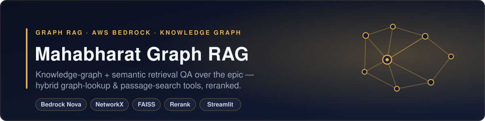

<div align="center">
  
</div>

# Mahabharat Graph RAG Chatbot

A knowledge-graph-powered question-answering system for the Mahabharata epic, built with **Graph RAG** (Retrieval-Augmented Generation). Ask complex questions about characters, family trees, alliances, battles, and events — and get answers grounded in both structured relationship data and source text passages.


---

## What is Graph RAG?

Standard RAG retrieves text passages by vector similarity. **Graph RAG** adds a structured knowledge graph layer, enabling the system to:

- Answer relationship questions precisely (`Who is Karna's biological mother?`) by traversing typed edges in a graph
- Answer narrative questions contextually (`Why did the Kurukshetra war start?`) via semantic passage search
- Combine both when needed — the agent decides at query time using a few-shot routing prompt

```
User Question
      │
      ├─ entity pre-extraction (O(n·m), zero LLM calls)
      ▼
  Nova Pro Agent ──── decides ────►  graph_lookup tool   ──► BFS on NetworkX graph
      │                               (hybrid retrieval)        + FAISS enrichment
      │             ──── decides ────►  passage_search tool ──► FAISS + graph expansion
      │                               (hybrid retrieval)        + cross-encoder rerank
      ▼
 Synthesized Answer  +  Interactive Graph Visualization  +  Retrieved Sources
```

### Two-Tool Hybrid Architecture

| Tool | When Used | Returns |
|---|---|---|
| `graph_lookup` | Who/what/how-related questions | Graph BFS context + RRF-merged, reranked supporting passages |
| `passage_search` | Why/how/narrative questions | Cross-encoder reranked passages + shallow graph expansion |

Both tools share signal: graph-lookup enriches the FAISS query with discovered entity names; passage-search scans retrieved passages for entity names and expands the graph. Results from two FAISS queries are fused with **Reciprocal Rank Fusion (RRF)** and reranked with a cross-encoder before being sent to the LLM.

---

## Features

- **Pre-seeded knowledge graph** — 53 hand-verified entities and 90+ typed relationships covering the full Kuru lineage, Pandavas, Kauravas, key teachers, places, and events — works immediately without any build
- **LLM-enriched graph** — Amazon Nova Lite extracts additional entities and relationships from the source PDF, augmenting the seed graph during the offline build
- **Transitive relationship inference** — post-build rule engine infers IS_GRANDFATHER_OF, IS_ALLY_OF, and IS_BROTHER_OF edges using two-hop pattern matching
- **Confidence-weighted BFS** — graph traversal prioritises high-confidence edges; context passed to the LLM is sorted by `high > medium > low` confidence
- **Community detection** — Louvain algorithm identifies character clusters; nodes are border-coloured by community in the graph visualizer
- **Hybrid search** — RRF fusion of dual FAISS queries + `ms-marco-MiniLM-L-6-v2` cross-encoder reranking
- **Few-shot agent routing** — system prompt contains three worked routing examples (graph-only, passage-only, both-tools) to guide tool selection
- **Entity pre-extraction** — question text is scanned against graph node names before the agentic loop and injected as a hint (zero LLM calls)
- **Interactive graph visualization** — pyvis-rendered subgraph showing exactly which nodes and edges informed each answer, community-coloured
- **Knowledge Graph Explorer tab** — browse the full character graph, search by entity, adjust traversal depth
- **Conversation memory** — multi-turn chat with rolling 4-turn history
- **Tool call transparency** — UI badges show whether the agent used graph traversal, passage search, or both, with entity and query details
- **Retrieved sources expander** — shows which graph entities were queried and which passage queries were run
- **Three-tier evaluation framework** — keyword/entity recall (Tier 1), RAGAS LLM-judged batch metrics (Tier 2), TruLens live RAG Triad tracing (Tier 3)

---

## Tech Stack

| Layer | Technology |
|---|---|
| LLM (answers + eval judge) | Amazon Nova Pro (`amazon.nova-pro-v1:0`) via AWS Bedrock |
| LLM (extraction) | Amazon Nova Lite (`amazon.nova-lite-v1:0`) — fast, cost-efficient |
| Agent framework | Bedrock Converse API tool-use (`graph_lookup`, `passage_search`) |
| Knowledge graph | NetworkX MultiDiGraph (in-memory, persisted to JSON) |
| Vector store | FAISS + `all-MiniLM-L6-v2` embeddings (runs locally) |
| Reranker | `cross-encoder/ms-marco-MiniLM-L-6-v2` (sentence-transformers) |
| Rank fusion | Reciprocal Rank Fusion (RRF, k=60) |
| Community detection | NetworkX Louvain (`nx.community.louvain_communities`) |
| PDF extraction | PyMuPDF |
| Frontend | Streamlit |
| Graph visualization | pyvis |
| Batch evaluation | RAGAS v0.4.3 (Faithfulness, AnswerRelevancy, ContextPrecision, ContextRecall) |
| Live evaluation | TruLens v2.7 (Groundedness, Context Relevance, Answer Relevance) |
| Package manager | uv |

---

## Quickstart

### 1. Clone and install

```bash
git clone https://github.com/ashish-code/mahabharat-graphrag.git
cd mahabharat-graphrag
uv sync
```

### 2. Configure AWS credentials

The app uses **AWS Bedrock** (Amazon Nova models). Configure your AWS credentials:

```bash
cp .env.example .env
# Edit .env with your AWS profile and region
```

```env
AWS_PROFILE=your-profile-name
AWS_REGION=us-east-1
```

Your AWS profile must have Bedrock access enabled for:
- `amazon.nova-pro-v1:0`
- `amazon.nova-lite-v1:0`
- `amazon.titan-embed-text-v2:0` (used by RAGAS evaluation)

You can also set `AWS_PROFILE` and `AWS_REGION` directly in the Streamlit sidebar at runtime.

### 3. Add the source PDF

```
data/pdf/Mahabharata.pdf
```

### 4. Build the index

The app works immediately with the pre-seeded graph. Larger builds enrich the graph with LLM-extracted relationships from the source text.

| Script | Chunks | Time | Coverage |
|---|---|---|---|
| `./build_fast.sh` | 200 | ~5 min | Books 1–2 |
| `./build_medium.sh` | 600 | ~15 min | Books 1–4 (recommended) |
| `./build.sh` | 8393 | ~45–60 min | Full Mahabharata |

```bash
./build_medium.sh
```

The build pipeline:
1. Extracts text from the PDF (PyMuPDF)
2. Builds a FAISS vector index with local embeddings — **no API cost**
3. Runs Nova Lite over text chunks to extract additional entities and relationships (with entity vocabulary injection for pronoun co-reference)
4. Merges extracted data with the pre-seeded character graph
5. Applies transitive inference rules (IS_GRANDFATHER_OF, IS_ALLY_OF, IS_BROTHER_OF)
6. Saves `data/graph.json` and `data/faiss_index/` — checkpointed every ~100 chunks so `Ctrl+C` preserves all progress

### 5. Run the app

```bash
uv run streamlit run app.py
```

---

## Project Structure

```
mahabharat-graphrag/
├── app.py                          # Streamlit frontend (chat + graph explorer + eval)
├── build_fast.sh                   # 200 chunks, ~5 min
├── build_medium.sh                 # 600 chunks, ~15 min (recommended)
├── build.sh                        # All 8393 chunks, ~60 min
├── data/
│   ├── eval_questions.json         # 25-question golden Q&A dataset (with reference answers)
│   └── pdf/
│       └── Mahabharata.pdf         # Source document (not included in repo)
└── src/mahabharat/
    ├── config.py                   # Models, paths, chunking, retrieval parameters
    ├── seed_data.py                # Pre-verified 53 entities + 90 relationships (confidence-labelled)
    ├── ingest.py                   # PDF → sliding-window text chunks (PyMuPDF)
    ├── extractor.py                # LLM entity/relationship extraction (Nova Lite, with entity hints)
    ├── inference.py                # Transitive relationship inference rules (post-build)
    ├── graph.py                    # NetworkX graph: build, save, load, BFS, community detection
    ├── vector_store.py             # FAISS index build/load + similarity search with scores
    ├── hybrid_retriever.py         # RRF fusion + cross-encoder reranking coordination layer
    ├── agent.py                    # Two-tool Nova Pro agent (few-shot routing, entity pre-extraction)
    ├── visualize.py                # pyvis graph → HTML (community-coloured nodes)
    ├── build.py                    # Offline build pipeline (incremental saves + inference)
    ├── eval.py                     # Tier 1: keyword/entity recall + tool accuracy (fast, no LLM)
    ├── eval_ragas.py               # Tier 2: RAGAS batch eval (LLM-judged, requires AWS)
    └── eval_trulens.py             # Tier 3: TruLens live RAG Triad tracing (requires AWS)
```

---

## Configuration

Key parameters in `src/mahabharat/config.py`:

| Parameter | Default | Description |
|---|---|---|
| `ANSWER_MODEL` | `amazon.nova-pro-v1:0` | Model for final answer synthesis and eval judging |
| `EXTRACTION_MODEL` | `amazon.nova-lite-v1:0` | Model for entity/relation extraction during build |
| `CHUNK_SIZE` | `2000` | Characters per text chunk |
| `CHUNK_OVERLAP` | `200` | Overlap between adjacent chunks |
| `EXTRACTION_BATCH` | `5` | Chunks processed per LLM extraction call |
| `TOP_K_HYBRID` | `8` | Passages retrieved per FAISS query (before RRF) |
| `RERANKER_TOP_N` | `5` | Passages kept after cross-encoder reranking |
| `RRF_K` | `60` | RRF damping constant (standard value) |
| `TOP_K_GRAPH_HOPS` | `2` | BFS traversal depth from seed nodes |
| `MAX_GRAPH_CONTEXT_NODES` | `20` | Max graph nodes passed to LLM context |
| `COMMUNITY_RESOLUTION` | `1.0` | Louvain resolution (higher = more, smaller communities) |

---

## Evaluation Framework

The system includes three evaluation tiers, accessible from the **📊 Evaluation** tab in the app:

### Tier 1 — Keyword / Entity / Tool Recall (fast, no LLM)

```bash
PYTHONPATH=src uv run python -m mahabharat.eval
```

Scores all 25 golden questions against keyword presence, entity mention, and correct tool selection. Runs in seconds with no API cost. Produces `data/eval_report.json`.

### Tier 2 — RAGAS Batch Evaluation (LLM-judged)

```bash
PYTHONPATH=src uv run python -m mahabharat.eval_ragas
```

Runs all 25 questions through the agent, then scores each answer using Amazon Nova Pro as judge via RAGAS v0.4.3. Produces `data/ragas_report.json`. Takes ~15 min.

| Metric | What it measures | Requires reference? |
|---|---|---|
| Faithfulness | Answer claims ⊆ retrieved context | No |
| Answer Relevancy | Answer addresses the question | No |
| Context Precision | Relevant context ranked above irrelevant | Yes |
| Context Recall | Context contains info needed to answer | Yes |
| Tool Call Accuracy | Correct tool(s) called for query type | Yes (`expected_tool`) |

### Tier 3 — TruLens Live RAG Triad (per-query tracing)

Automatically records traces to `data/trulens.db` when you click **🔬 Evaluate this response** in the Chat tab. The TruLens Streamlit dashboard can be launched from the Evaluation tab.

| Metric | What it measures |
|---|---|
| Groundedness | Answer statements backed by retrieved context |
| Context Relevance | Retrieved context is relevant to the query |
| Answer Relevance | Answer is relevant to the query |

### Golden Q&A Dataset

`data/eval_questions.json` contains 25 hand-crafted questions across 5 categories:

| Category | Count | Focus |
|---|---|---|
| family | 7 | Parentage, lineage, marriages |
| combat | 5 | Kills, battles, weapons |
| narrative | 6 | Story events, reasons, motivations |
| philosophical | 3 | Dharma, Gita teachings, character virtues |
| multi-hop | 4 | Two-step reasoning across relationships |

Each entry includes `expected_entities`, `expected_keywords`, `expected_tool`, and a `reference` ground-truth answer for LLM-judged metrics.

---

## Example Questions

**Relationship questions** (uses `graph_lookup`):
- *What is the relationship between Karna and the Pandavas?*
- *Describe the family tree of the Kauravas.*
- *Who were the teachers of Arjuna?*
- *How is Draupadi related to Drupada and Dhrishtadyumna?*

**Narrative questions** (uses `passage_search`):
- *What happened during the dice game?*
- *What is the central teaching of the Bhagavad Gita?*
- *What happened during the Pandavas' exile?*

**Complex questions** (uses both tools):
- *Why did Bhishma take a vow of celibacy?*
- *Who killed Drona and why?*
- *Why did Karna not join the Pandavas when Kunti revealed his parentage?*

---

## License

MIT
